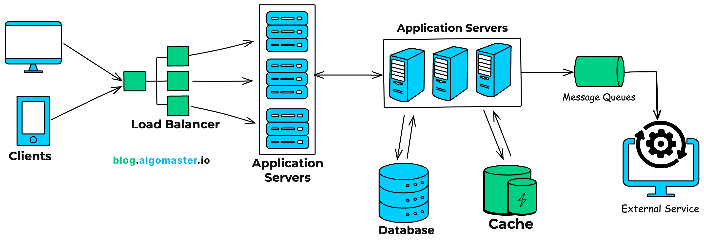

# System Design 101

This guide is intended to demystify what System Design is, why it matters, and the core building blocks used to architect scalable, reliable software systems.

## What is System Design?

**System Design** is the process of defining the architecture, components, modules, interfaces, and data for a system to satisfy specified requirements. It is the bridge between a vague problem statement and a functional, code-ready blueprint.

> **Analogy:** If writing code is like laying bricks, System Design is architectural planning. You can build a doghouse without a blueprint, but if you are building a skyscraper (a scalable, distributed system), you need a robust plan to ensure it doesn't collapse under its own weight (load).

---

## Primary Goals

When designing a system, we generally aim to balance several competing priorities:

1.  **Scalability:** The ability of the system to handle growing amounts of work (traffic/data) by adding resources.
    - _Vertical Scaling:_ Adding more power (CPU/RAM) to an existing machine.
    - _Horizontal Scaling:_ Adding more machines to the pool of resources.

2.  **Reliability:** The probability a system will fail in a given period. The system should continue to function correctly even when hardware or software fails.
3.  **Availability:** The time the system remains operational and accessible. (Often measured in nines, e.g., 99.999%).
4.  **Maintainability:** How easy it is to operate, test, and evolve the system over time.

---

## Core Building Blocks

Modern distributed systems are composed of these fundamental components:

### 1. Load Balancers

Distributes incoming network traffic across multiple servers to ensure no single server bears too much load. This improves responsiveness and availability.

### 2. Databases (Data Layer)

- **Relational (SQL):** Structured data with predefined schemas (e.g., PostgreSQL, MySQL). Good for complex queries and transactions (ACID).
- **Non-Relational (NoSQL):** Unstructured or semi-structured data (e.g., MongoDB, Cassandra). Good for massive scale, flexibility, and high write speeds.

### 3. Caching

A high-speed data storage layer (usually RAM-based) that stores a subset of data. It allows for faster retrieval than fetching from the main database (e.g., Redis, Memcached).

### 4. Message Queues (Asynchronous Processing)

buffers requests between services. If Service A produces data faster than Service B can process it, the queue holds the data until B is ready, decoupling the services (e.g., Kafka, RabbitMQ).

### 5. CDNs (Content Delivery Networks)

A geographically distributed network of proxy servers. They deliver static content (images, CSS, videos) to users based on their geographic location to reduce latency.

---

## Key Concepts & Theorems

- **CAP Theorem:** States that a distributed data store can only guarantee two of the following three: **C**onsistency, **A**vailability, and **P**artition Tolerance.
- **Sharding (Data Partitioning):** Splitting a large database into smaller, faster, more easily managed parts called data shards.
- **Microservices vs. Monolithic:** The choice between building an application as a single unit (Monolith) or a collection of small, independent services (Microservices).

---

## External Resources

_Below is a curated list of articles, videos, and books to deepen your understanding._

### Essential Reading

- [Monolith architecture](https://martinfowler.com/bliki/MonolithFirst.html) - An account by martin fowler why always start with a monolith architecture.
- [Microservices architecture](https://martinfowler.com/articles/microservices.html) - An account by martin fowler what are microservices architecture.
- [Advantages of monorepos](https://danluu.com/monorepo/) - Why should we use monorepos

---
